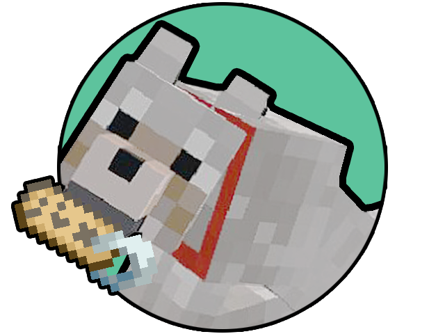

 

# 🔧 How it works
Every time a living entity dies on your server, a name tag with it's name will be dropped. This
won't take your precious pet back, but at least you'll have the ability to name another one with the same name
without using another name tag.

You can also decide which entities will drop the name tag, or even if they will drop if they have 
a certain name using commands that you'll find [on the Wiki](https://github.com/JimiIT92/NameTagKeeper/wiki).

# 📜 Requirements
NameTagKeeper does not require any additional plugin or mod to run, other than [Sponge itself](https://www.spongepowered.org/downloads/). 
The plugin runs both on Sponge Vanilla and Sponge Forge.

# ✔ Compatibility
NameTagKeeper has been built on top of **Sponge API 7.2.0** and has been tested on **Minecraft 1.12.2**.

Unless some major changes happens on either Sponge API or Minecraft itself, the plugin should work on newest versions as well.

If you find any bug related to a new version of one of these, please report them to the [Issue Tracker](https://github.com/JimiIT92/NameTagKeeper/issues).

# 📖 Documentation

You can find any information about NameTagKeeper inside the [Wiki](https://github.com/JimiIT92/NameTagKeeper/wiki).

# 👨🏼‍💻 How to contribute
You can add your contribute to the project via [Pull Requests](https://github.com/JimiIT92/NameTagKeeper/pulls).

# 🖥 Downloads

You can download NameTagKeeper from the [Sponge Ore]().

This is the only place where I directly upload new releases. Every other website shouldn't be trusted.

# 🍺 Support the project
Developing and maintaining this plugin requires some time and effort, but after all I really enjoy doing this ❤

This plugin is **FREE TO USE** and will ALWAYS be. If someone asked you some money, you got scammed! 😥 

But if you want to show some support to the project (or just buy me some beer to produce more code), these are the only ways:

&emsp;&emsp;&emsp;&emsp;&emsp;

Any other websites asking you money for this project is a scam, and you should immediately report it! 😡

# 😁 In conclusion

I hope you like NameTagKeeper and make it grow! Peace! 😁
